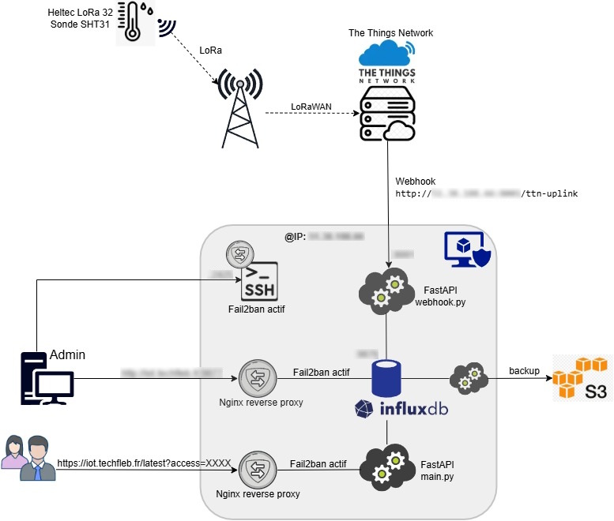

# lorawan-playground
# 📡 Projet LoRaWAN – FastAPI & TTN

Ce projet collecte des données environnementales (température et humidité) via un capteur LoRa, les transmet à The Things Network (TTN), puis les affiche via une API FastAPI hébergée sur un serveur cloud.

## Architecture



- **Capteur** : Heltec LoRa 32 + sonde SHT31
- **Réseau** : LoRaWAN via TTN
- **Webhook TTN** : `http://xx.xx.xx.xx:yyyy/ttn-uplink`
- **Serveur** : FastAPI sur port `yyyy` (webhook) et `zzzz` (page web)
- **Page Web** : `https://iot[dot]techfleb[dot]fr/latest?access=XXXXXX` (HTML dynamique, voir .env pour access)
- **Stockage** :
  - **InfluxDB 2** : écoute en local sur `tttt`, protection **Fail2ban**
  - **Accès public** : via **reverse proxy Nginx** sur `uuuu`, IP autorisées seulement
- **Archivage** :
  - Script Python `archive-s3.py`
  - Tâche cron via `run_archive_s3.sh` pour export quotidien vers **Object Storage S3**

## Sécurité

- **Fail2ban actif** sur SSH, InfluxDB et endpoint `latest?access=XXXX`, voir `/etc/fail2ban`
- **Filtrage TTN** : seuls les `dev_eui` autorisés sont acceptés, voir .env (`403 Forbidden` sinon)
- **Reverse Proxy Nginx** : protège l’accès public à InfluxDB (IP autorisées) et la page web /latest (en HTTPS)
- **HTTPS** : Nginx + Certbot

##  API FastAPI

- `/ttn-uplink` : reçoit les données TTN
- `/latest/access=XXXXXX` : affiche les dernières mesures en HTML, voir .env pour access

##  Déploiement

```bash
nohup uvicorn main:app --host 127.0.0.1 --port zzzz &
nohup uvicorn webhook:app --host 0.0.0.0 --port yyyy > webhook.log 2>&1 &
```

##  Programme Arduino – Carte Heltec LoRa 32

Ce projet utilise une carte **Heltec LoRa 32** pour transmettre les données d’une sonde **SHT31** via **LoRaWAN** vers **The Things Network**.

###  Fonctionnalités principales

- Lecture des données environnementales via le capteur **SHT31** (température et humidité RH)
- Transmission LoRa vers **TTN** toutes les 12 minutes (5x par heure)
- Stockage en base de données InfluxDB 2
- Endpoint en HTTPS pour affichage des dernières mesures : `https://iot[dot]techfleb[dot]fr/latest?access=XXXXXX`, voir .env pour access 
- Archivage quotidien des mesures en JSON à 00:00:00 UTC avec Object Storage S3

###  Sources du programme Arduino

- [Voir le dossier arduino](arduino/)
